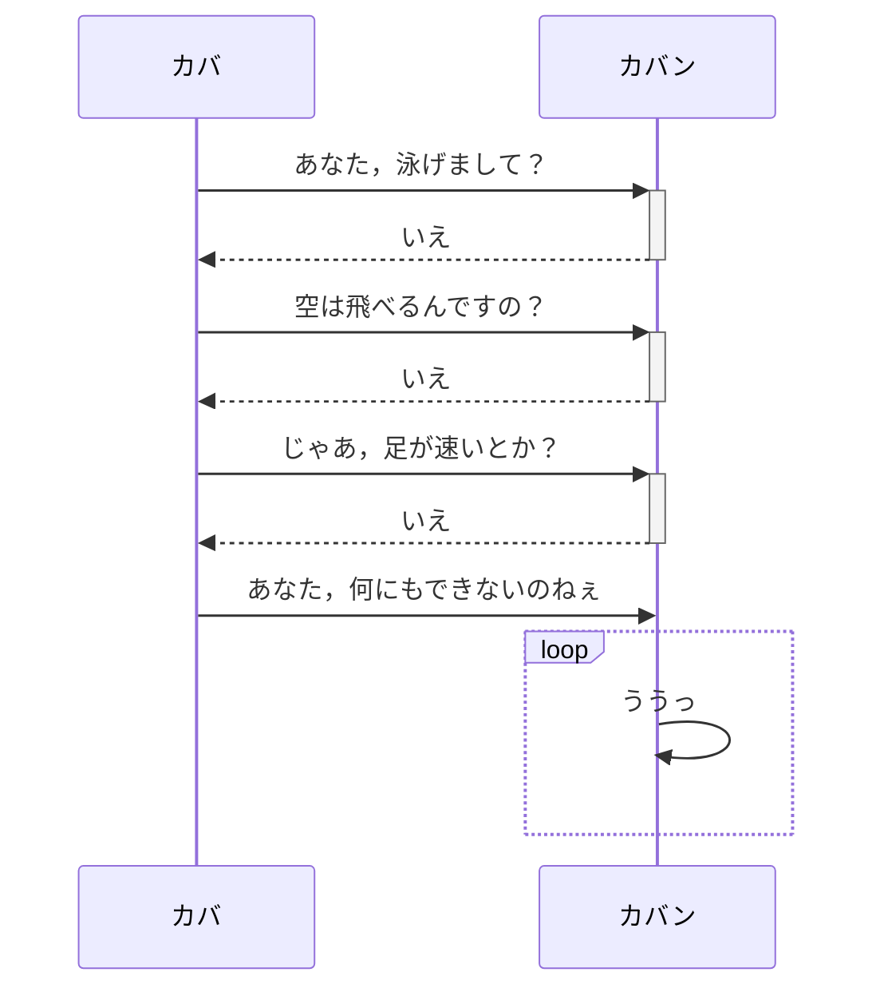
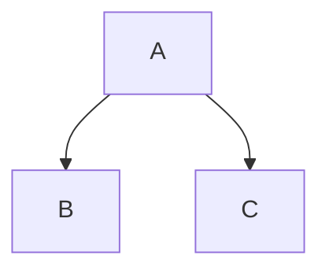

```mermaid
sequenceDiagram
    カバ->>+カバン: あなた，泳げまして？
    カバン-->>-カバ: いえ
    カバ->>+カバン: 空は飛べるんですの？
    カバン-->>-カバ: いえ
    カバ->>+カバン: じゃあ，足が速いとか？
    カバン-->>-カバ: いえ
    カバ->>カバン: あなた，何にもできないのねぇ
    loop
        カバン->>カバン: ううっ
    end
```

```mermaid
graph TD;
    A-->B;
    A-->C;
```