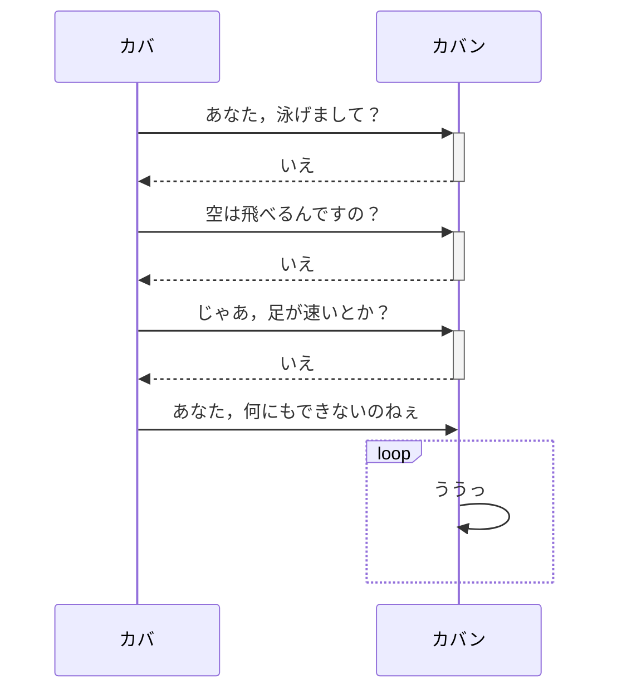

```mermaid
sequenceDiagram
    カバ->>+カバン: あなた，泳げまして？
    カバン-->>-カバ: いえ
    カバ->>+カバン: 空は飛べるんですの？
    カバン-->>-カバ: いえ
    カバ->>+カバン: じゃあ，足が速いとか？
    カバン-->>-カバ: いえ
    カバ->>カバン: あなた，何にもできないのねぇ
    loop
        カバン->>カバン: ううっ
    end
```
graph TD;
    A-->B;
    A-->C;
    B-->D;
    C-->D;

  flowchart LR
    家==>職場
    職場-->Q{お腹空いた?}
    Q==>|Yes|ダイエー
    Q-->|No|ジュンク堂
    ジュンク堂-->ダイエー
    ダイエー-->家