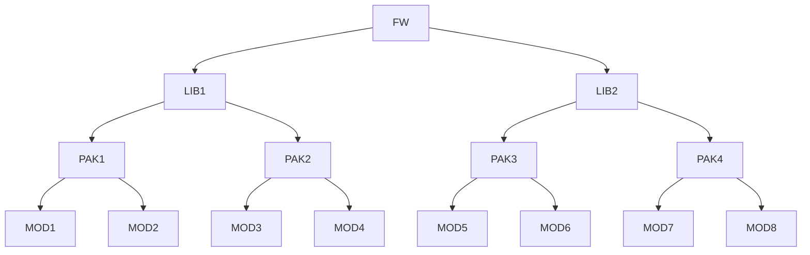

コードの量から考えてみる

## ライブラリ
- ライブラリ（英: library）は、汎用性の高い複数のプログラムを再利用可能な形でひとまとまりにしたものである。ライブラリと呼ぶときは、それ単体ではプログラムとして動作させることはできない、つまり実行ファイルではない場合がある。ライブラリは他のプログラムに何らかの機能を提供するコードの集まりと言える。

## API
- アプリケーションプログラミングインタフェース（API、英: Application Programming Interface）とは、広義ではソフトウェアコンポーネント同士が互いに情報をやりとりするのに使用するインタフェースの仕様である。

## コンポーネント
- ソフトウェアコンポーネント（英: software component / software componentry）は、ソフトウェアシステムの様々な機能を関心の分離によって分割したものである。システムを独立した結合の弱い再利用可能なコンポーネント（部品）群で構成する設計技法は Component-Based Software Engineering (CBSE) と呼ばれ、ソフトウェア工学の一分野となっている。

## モジュール
- moduleとは、部品などの集まりのこと。プログラム単位？
- ソフトウェア工学におけるモジュールは、ソフトウェアシステムを構成する部分的プログラムである。

- モジュール分割はソフトウェア開発工程に影響を与える。なぜなら良く分割されたモジュールはそれぞれ独立して実装・テスト・改修できるからである。各モジュールに開発者を割り当てることでモジュール群の並行開発が可能になり、全体の完成を早めることができる。またモジュールの入れ替えで機能を高めたり補修したりできる。モジュールが正しく分割できていない場合、複数の開発者の変更内容に矛盾が生じたり、変更のために多くの開発者の同意が必要になったりすることで開発工程に影響を与える。

## フレームワーク
- frameとは枠や枠組みのこと。
- アプリケーションフレームワーク (英: application framework) とは、プログラミングにおいて、典型的・定型的なアプリケーションソフトウェアの標準構造を実装するのに使われる枠組みやテンプレートのことであり、ライブラリ（サブルーチンやクラスなど）の集合を含む。ソフトウェアフレームワークの一種であり、単にフレームワークとも呼ぶ。特定のプラットフォーム（オペレーティングシステム）のための専用フレームワークであることもあれば、複数のプラットフォームをサポートするものもある。

SDK＜FW＜LIB=MOD＜class＜code＜

api・PAK・

建築的に考えるソフトウェア開発用語

プログラミング言語=使用する主要な素材（RC、SRC、木、S）  
  
SDK=重機・重機＋構造体  
  
FW=構造体、木造なら伝統軸組工法、在来軸組工法、ツーバイフォー工法、集成材工法
  
LIB=工場製作の建具など、現場で作らない外部から持ってくる部品、
  
MOD=現場製作の建具など、造作とも呼ばれる、現場で作る部品  
  
class=板面、ハンドル、丁番、ネジ、使用する素材、などを集約したもの
  
func=classを定義する為に便利なcode郡、
code=枠やガラスの位置や素材、座標などの情報
  
API=渡り廊下・道路、他の建物と連携するためのもの、  
  
PAK=パッケージ化されたもの。単位はそれぞれ異なる。太陽光発電パッケージなど。
  
